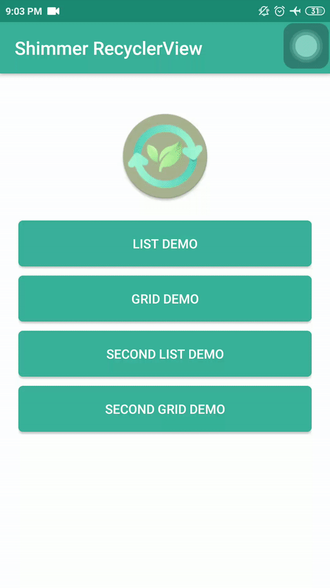
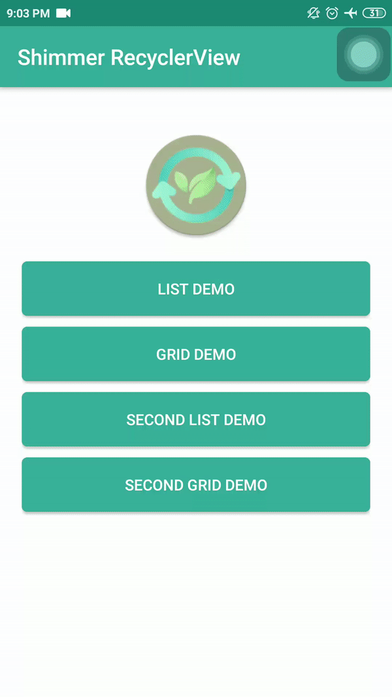

# ShimmerRecyclerView

[](https://www.android.com)
[](https://www.apache.org/licenses/LICENSE-2.0.html)
[](https://docs.gradle.org/current/release-notes)
[](https://java-lang.github.io/awesome-java)

A beautiful Shimmerring effect for RecyclerView Examples in Java using Library.

# Source
Repo to demonstrate Shimmerring effect for RecyclerView in Android. This is a follow up on the github at :

[ShimmerRecyclerView](https://github.com/sharish/ShimmerRecyclerView)

# Demo App

[Demo Download](https://github.com/achmadqomarudin/ShimmerRecyclerView/blob/master/screenshots/app-demo.apk)

There are two kinds of shimmer animation which you can see here:

1. This type of shimmer effect uses the whole ViewHolder item to animate on.

|     List Demo                |        Grid Demo              | 
| ----------------------------  | ----------------------------- | 
|  |    |

2. Here the shimmer effect only applied on for those views which background color is nontransparent.

|     List Demo                |        Grid Demo              |
| ----------------------------  | ----------------------------- |
|  |    |


### Shimmer effect types

1. As you can see the first demo examples show that the whole ViewHolder item is animated. To achieve the desired effect, the children of the ShimmerLayout should have a nontransparent background.
2. You can achieve the second kind of shimmer effect by adding only one ViewGroup child to the ShimmerLayout with a transparent background. This ViewGroup will have the other views with nontransparent backgrounds on which the effect will be seen.

   You may wonder how can you add background to the root view of the ViewHolder, if you do not have direct access to the ShimmerLayout and the only child has a nontransparent background. The solution for this is to use the `shimmer_demo_view_holder_item_background` attribute.

### Attributes and Methods

Following are the attributes and methods to initialise the demo views.

| XML Attributes | Java Methods | Explanation |
| -------------  | ------------ | ----------- | 
|```app:shimmer_demo_child_count``` | ```setDemoChildCount(int)``` | Integer value that sets the number of demo views should be present in shimmer adapter. |
|```app:shimmer_demo_layout``` | ```setDemoLayoutReference(int)``` | Layout reference to your demo view. Define your my_demo_view.xml and refer the layout reference here. |
|```app:shimmer_demo_layout_manager_type``` | ```setDemoLayoutManager(LayoutManagerType)``` | Layout manager of demo view. Can be one among linear_vertical or linear_horizontal or grid. |
|```app:shimmer_demo_shimmer_color``` | ``` - ``` | Color reference or value. It can be used to change the color of the shimmer line. |
|```app:shimmer_demo_angle``` | ``` - ``` | Integer value between 0 and 30 which can modify the angle of the shimmer line. The default value is zero. |
|```app:shimmer_demo_mask_width``` | ``` setDemoShimmerMaskWidth(float) ``` | Float value between 0 and 1 which can modify the width of the shimmer line. The default value is 0.5. |
|```app:shimmer_demo_view_holder_item_background``` | ``` - ``` | Color or an xml drawable for the ViewHolder background if you want to achieve the second type of shimmer effect. |
|```app:shimmer_demo_reverse_animation``` | ``` - ``` | Defines whether the animation should be reversed. If it is true, then the animation starts from the right side of the View. Default value is false. |


# Usage

Define your xml as:

```xml
<com.cooltechworks.views.shimmer.ShimmerRecyclerView
        xmlns:app="http://schemas.android.com/apk/res-auto"
        android:id="@+id/shimmer_recycler_view"
        android:layout_width="match_parent"
        android:layout_height="match_parent"
        app:shimmer_demo_child_count="10"
        app:shimmer_demo_grid_child_count="2"
        app:shimmer_demo_layout="@layout/layout_demo_grid"
        app:shimmer_demo_layout_manager_type="grid"
        app:shimmer_demo_angle="20"
        />

```
where ```@layout/layout_demo_grid``` refers to your sample layout that should be shown during loading spinner. Now on your activity onCreate, initialize the shimmer as below:

```java
ShimmerRecyclerView shimmerRecycler = (ShimmerRecyclerView) findViewById(R.id.shimmer_recycler_view);
shimmerRecycler.showShimmerAdapter();
```

Adding to your project
------------------------

- Add the following configuration in your build.gradle file.

```gradle
repositories {
    jcenter()
    maven { url "https://jitpack.io" }
}

dependencies {
    implementation 'com.github.sharish:ShimmerRecyclerView:v1.3'
}
```

# License

```
    Copyright (C) Achmad Qomarudin

    Licensed under the Apache License, Version 2.0 (the "License");
    you may not use this file except in compliance with the License.
    You may obtain a copy of the License at

       http://www.apache.org/licenses/LICENSE-2.0

    Unless required by applicable law or agreed to in writing, software
    distributed under the License is distributed on an "AS IS" BASIS,
    WITHOUT WARRANTIES OR CONDITIONS OF ANY KIND, either express or implied.
    See the License for the specific language governing permissions and
    limitations under the License.
```
